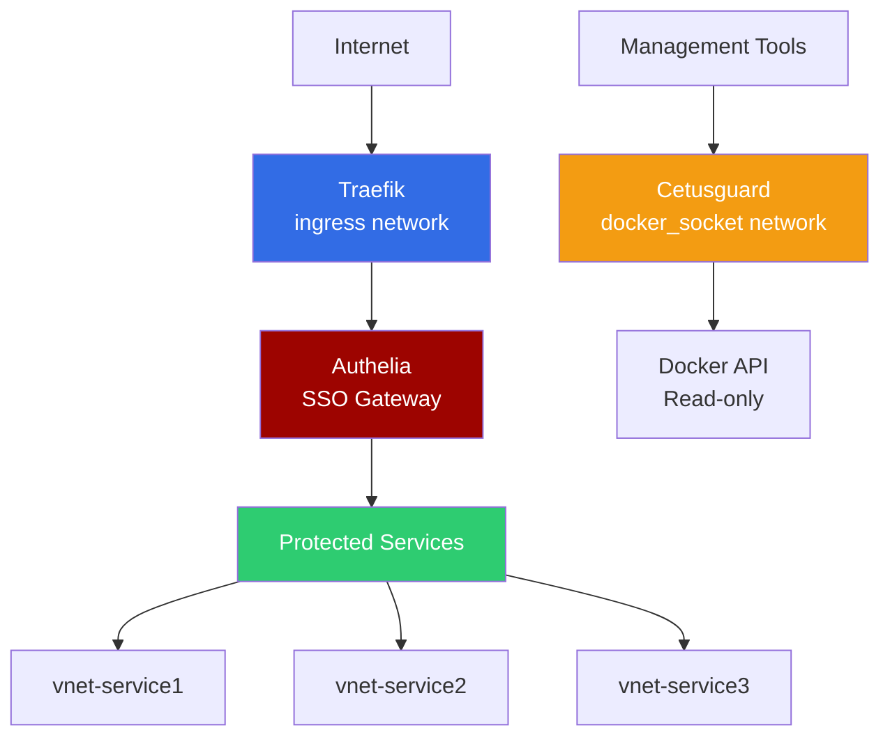
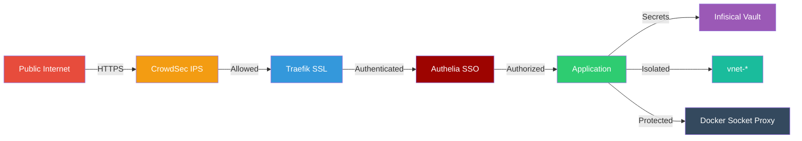

# Omakase Documentation

Welcome to **Omakase**, a production-ready Docker homelab infrastructure managing 25+ containerized services with a security-first architecture.

!!! info "What is Omakase?"
    Omakase (お任せ) is a Japanese phrase meaning "I'll leave it up to you" - perfectly capturing the philosophy of this project: a curated, opinionated, ready-to-deploy homelab infrastructure where all the hard decisions have been made for you.

!!! note "About This Documentation"
    The documentation and guides in this project are AI-assisted to provide comprehensive and helpful content. However, **all Docker Compose configurations, service definitions, and infrastructure code are manually written and thoroughly reviewed by the maintainer** to ensure security, reliability, and correctness.

## Why Omakase?

<div class="grid cards" markdown>

-   :material-security: **Security First**

    ---

    Multi-layered security with Authelia SSO, CrowdSec IPS, Infisical secrets management, and network isolation.

    [:octicons-arrow-right-24: Security Overview](security/index.md)

-   :material-docker: **Infrastructure as Code**

    ---

    Fully declarative Docker Compose setup with modular service architecture and automatic secret injection.

    [:octicons-arrow-right-24: Architecture](infrastructure/network-architecture.md)

-   :material-backup-restore: **Built-in Backup**

    ---

    Automated encrypted backups with Restic to cloud storage (Backblaze B2) with verification and pruning.

    [:octicons-arrow-right-24: Backup Guide](operations/backup.md)

-   :material-robot: **Fully Automated**

    ---

    Renovate bot for dependency updates, CI/CD with GitHub Actions, automatic SSL certificates, and monitoring.

    [:octicons-arrow-right-24: Operations](operations/maintenance.md)

-   :material-puzzle: **Modular Design**

    ---

    Enable/disable services easily with include directives. Each service is isolated and independently configurable.

    [:octicons-arrow-right-24: Adding Services](contributing/adding-services.md)

-   :material-chart-line: **Production Ready**

    ---

    Battle-tested in production with 25+ services, comprehensive monitoring, and proven disaster recovery.

    [:octicons-arrow-right-24: Deployment Scenarios](deployment/index.md)

</div>

## Core Services

Omakase includes essential infrastructure components:

| Service | Version | Purpose | Documentation |
|---------|---------|---------|---------------|
| **Traefik** | v3.5 | Reverse proxy with automatic HTTPS | [→](infrastructure/traefik.md) |
| **Authelia** | v4.39 | SSO authentication gateway | [→](infrastructure/authelia.md) |
| **CrowdSec** | v1.7 | Collaborative IPS and security | [→](infrastructure/crowdsec.md) |
| **Cetusguard** | latest | Secure Docker socket proxy | [→](infrastructure/cetusguard.md) |
| **Portainer** | latest | Container management UI | [→](services/index.md) |
| **Homepage** | latest | Unified dashboard | [→](services/index.md) |
| **Dozzle** | latest | Real-time log viewer | [→](services/index.md) |
| **Restic** | latest | Encrypted backup solution | [→](operations/backup.md) |

Plus 20+ additional services for media, productivity, development, and more!

## Quick Start

Get started in 3 simple steps:

```bash
# 1. Clone the repository
git clone https://github.com/esoso/omakase.git
cd omakase

# 2. Configure secrets in Infisical
# (See Getting Started guide)

# 3. Deploy the stack
make up
```

**First time here?** Start with:

1. [Prerequisites](getting-started/prerequisites.md) - Check what you need
2. [Choose Your Deployment](deployment/index.md) - Pick your environment
3. [Installation Guide](getting-started/installation.md) - Deploy Omakase
4. [Configuration](getting-started/configuration.md) - Customize your setup

## Architecture Highlights

### Network Isolation



### Security Layers



## Deployment Scenarios

Omakase supports multiple deployment environments:

| Environment | Complexity | Cost | Performance | Best For |
|-------------|------------|------|-------------|----------|
| **[Proxmox LXC](deployment/proxmox-lxc.md)** | Medium | Low | Excellent | Advanced homelab |
| **[Bare Metal](deployment/bare-metal.md)** | Low | Low | Excellent | Simple homelab |
| **[VM Generic](deployment/vm-generic.md)** | Low | Low | Good | Testing |
| **[NAS](deployment/nas.md)** | Low | Low | Good | Existing NAS |
| **[Cloud VPS](deployment/cloud-vps.md)** | Low | Medium | Good | Remote access |
| **[Cloud Enterprise](deployment/cloud-enterprise.md)** | High | High | Excellent | Production |

[:octicons-arrow-right-24: Compare Deployment Options](deployment/index.md)

## Key Features

### :material-shield-check: Security-First Architecture

- **Zero Trust Network**: Every service isolated in dedicated networks
- **SSO Authentication**: Authelia protects all services with 2FA support
- **Secret Management**: All secrets stored in Infisical vault, never in git
- **IPS Protection**: CrowdSec blocks threats automatically
- **Container Hardening**: `no-new-privileges`, resource limits, non-root users

### :material-autorenew: Automated Operations

- **Dependency Updates**: Renovate bot updates Docker images automatically
- **Backup & Verify**: Daily encrypted backups with integrity checks
- **SSL Certificates**: Automatic Let's Encrypt certificate management
- **Health Checks**: Monitoring with alerts via Telegram/Email
- **CI/CD Pipeline**: Automated validation and deployment

### :material-code-braces: Infrastructure as Code

- **Declarative Setup**: Everything defined in Docker Compose files
- **Version Controlled**: All configuration tracked in git
- **Reproducible**: Deploy identical infrastructure anywhere
- **Documented**: Comprehensive docs for every component

## Technology Stack

<div class="grid cards" markdown>

-   :fontawesome-brands-docker: **Docker Ecosystem**

    Docker 24+, Compose v2.20+, dedicated networks per service

-   :material-security-network: **Security Stack**

    Traefik, Authelia, CrowdSec, Infisical, Cetusguard

-   :material-database: **Data Persistence**

    PostgreSQL, Redis (Redict), encrypted backups with Restic

-   :material-monitor-dashboard: **Management**

    Portainer, Homepage, Dozzle, Traefik dashboard

</div>

## Community & Support

- **Documentation**: You're reading it! Browse sections above
- **GitHub Issues**: [Report bugs and request features](https://github.com/esoso/omakase/issues)
- **Discussions**: [Ask questions and share setups](https://github.com/esoso/omakase/discussions)
- **Security**: [Report security issues](https://github.com/esoso/omakase/security/advisories/new)

## Contributing

Omakase is open source and welcomes contributions! Whether you want to:

- Add a new service
- Improve documentation
- Fix bugs
- Share your deployment experience

Check out the [Contributing Guide](contributing/index.md) to get started.

## License

Omakase is licensed under the [MIT License](https://github.com/esoso/omakase/blob/main/LICENSE).

---

<div class="grid cards" markdown>

-   :material-clock-fast: **Quick Links**

    ---

    - [Prerequisites](getting-started/prerequisites.md)
    - [Installation](getting-started/installation.md)
    - [Deployment Options](deployment/index.md)
    - [Troubleshooting](operations/troubleshooting.md)

-   :material-file-document: **Documentation**

    ---

    - [Network Architecture](infrastructure/network-architecture.md)
    - [Security Best Practices](security/best-practices.md)
    - [Backup & Restore](operations/backup.md)
    - [Adding Services](contributing/adding-services.md)

</div>

!!! tip "Star on GitHub"
    If you find Omakase useful, please [:octicons-star-fill-24: star the repository on GitHub](https://github.com/esoso/omakase) to show your support!
