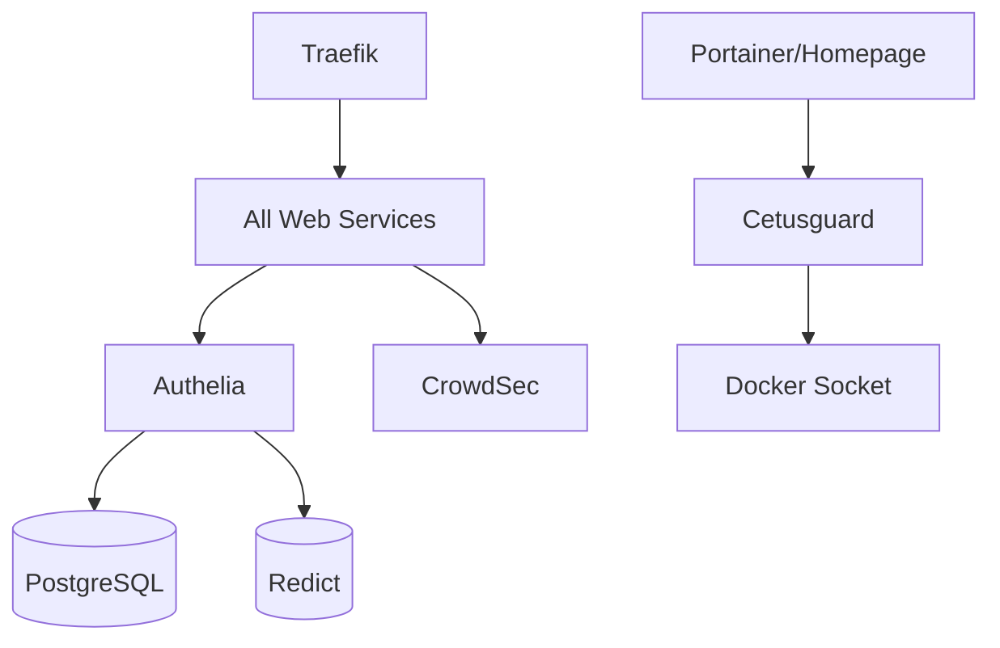

# Services Overview

Omakase includes 25+ containerized services organized by category. Each service is modular and can be enabled/disabled independently.

## Service Categories

### Core Infrastructure

Essential services that should always run:

| Service | Purpose | Port |
|---------|---------|------|
| **Traefik** | Reverse proxy & SSL | 80, 443 |
| **Authelia** | SSO authentication | - |
| **CrowdSec** | IPS & security | - |
| **Cetusguard** | Docker socket proxy | - |

### Management & Monitoring

| Service | Purpose | Default URL |
|---------|---------|-------------|
| **Portainer** | Container management UI | `portainer.${DOMAINNAME}` |
| **Homepage** | Unified dashboard | `home.${DOMAINNAME}` |
| **Dozzle** | Real-time log viewer | `dozzle.${DOMAINNAME}` |

### Databases

| Service | Type | Used By |
|---------|------|---------|
| **PostgreSQL** | Relational DB | Authelia, Nextcloud, others |
| **Redict** (Redis) | Key-value store | Authelia, caching |

### Backup

| Service | Purpose |
|---------|---------|
| **Restic** | Encrypted backups |

## Enabling Services

Services are included via `compose.prod.yaml`:

```yaml
include:
  - path: compose/traefik/compose.yaml
  - path: compose/authelia/compose.yaml
  - path: compose/myservice/compose.yaml  # Add your service here
```

To enable a service:

1. Add the service's `compose.yaml` to the include list
2. Configure secrets in Infisical
3. Redeploy: `make restart`

## Adding New Services

Quick checklist:
- [ ] Create `compose/<service>/compose.yaml`
- [ ] Configure dedicated `vnet-<service>` network
- [ ] Add security options (`no-new-privileges:true`)
- [ ] Configure secrets in Infisical
- [ ] Add Traefik labels if web-accessible
- [ ] Document service in `docs/services/<service>.md`
- [ ] Test deployment

## Service Status

To check service status:

```bash
# All services
docker compose ps

# Specific service
docker compose ps <service-name>

# Detailed status
docker compose logs -f <service-name>
```

## Resource Usage

View real-time resource consumption:

```bash
# Docker stats
docker stats

# Per-service resource limits are defined in compose files
```

## Service Dependencies

Some services depend on others:


